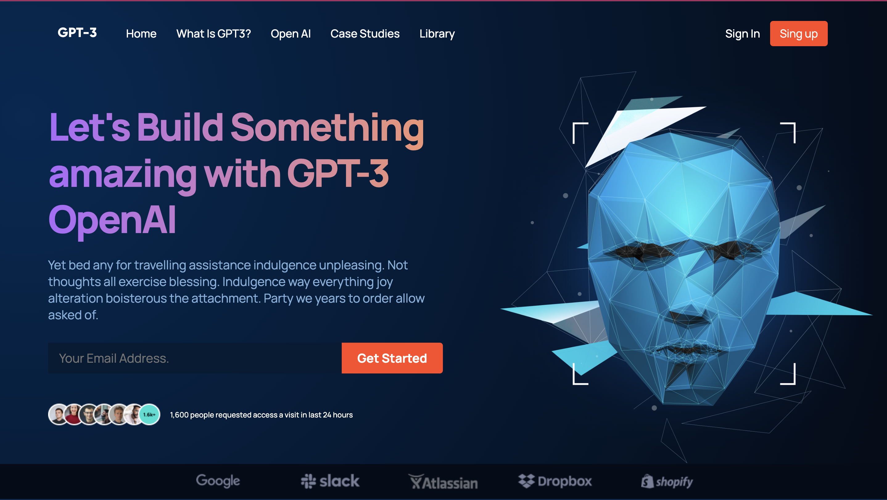

# Fully Responsive GPT-3 Website  
Modern UI/UX built with ReactJS  

  

## [Live Demo](https://mb-gpt-3.netlify.app/)  

### **Overview**  
This project is a fully responsive website showcasing modern design and functionality. It leverages ReactJS to deliver a clean user interface, reusable components, and responsive design.

Transform a **[Figma Design]([https://www.figma.com/design/lz9lLpFHMxHm2odnwM3R0z/gpt3?node-id=0-1&p=f&t=ZCx6hEuI3udctkGC-0))** to a fully responsive website.

---

## **Features**  
- **React Functional Components**: Modular and reusable components for scalability.  
- **Organized Folder Structure**: Clean and intuitive project structure.  
- **CSS with Flexbox & Grid**: Applied advanced layout techniques for consistency and responsiveness.  
- **CSS BEM Methodology**: Ensures CSS class names are readable and maintainable.  
- **Animations & Gradients**: Enhanced user experience with soft animations and elegant gradients.  
- **Media Queries**: Adaptable layout for seamless responsiveness across all devices.  

---

## **Inspiration from [JavaScript Mastery](https://www.youtube.com/@javascriptmastery)**  
This project was inspired by **JavaScript Mastery**.

# Getting Started with Create React App

This project was bootstrapped with [Create React App](https://github.com/facebook/create-react-app).

## Available Scripts

In the project directory, you can run:

### `npm start`

Runs the app in the development mode.\
Open [http://localhost:3000](http://localhost:3000) to view it in your browser.

### `npm run build`

Builds the app for production to the `build` folder.\
It correctly bundles React in production mode and optimizes the build for the best performance.

The build is minified and the filenames include the hashes.\
Your app is ready to be deployed!

See the section about [deployment](https://facebook.github.io/create-react-app/docs/deployment) for more information.

